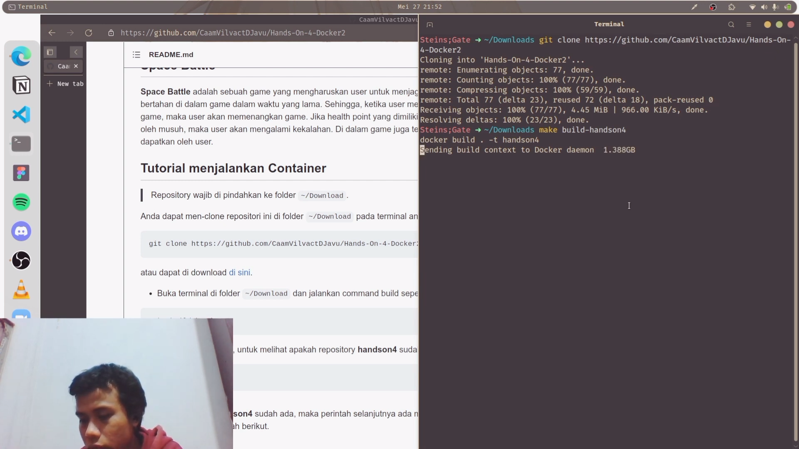

# Hands-On-4 Docker 2
> Ilham Fadhlur Rahman - 120140125 - Sistem Operasi RA

## Deskripsi Tugas
Anda akan diminta membuat kontainer berisi program python menggunakan docker. Tugas ini sangat relevan dengan standar penggunaan docker sebagai sebuah *wrapper* di perusahaan dan startup yang ada saat ini.

Program python yang akan anda *wrap* adalah tugas akhir Pemrograman Berorientasi Objek sehingga dapat disimpulkan bahwa hands on ini adalah kombinasi dari dua mata kuliah. Pada mata kuliah PBO, anda mendapat tugas besar untuk merancang sebuah permainan dengan pendekatan pemrograman berorientasi objek dengan bahasa pemrograman python. Gunakanlah kontainer docker untuk “membungkus” program game tersebut.

## Space Battle
**Space Battle** adalah sebuah game yang mengharuskan user untuk menjaga pesawat miliknya, supaya dapat bertahan di dalam game dalam waktu yang lama. Sehingga, ketika user mengalahkan Boss yang ada di dalam game, maka user akan memenangkan game. Jika health point yang dimiliki user telah habis, karena sering di serang oleh musuh, maka user akan mengalami kekalahan. Di dalam game juga terdapat jumlah score yang telah di dapatkan oleh user.

## Tutorial menjalankan Container

> Repository wajib di pindahkan ke folder `~/Download`.

Anda dapat men-clone repositori ini di folder `~/Download` pada terminal anda dengan cara mengetik-kan:

```CLI
git clone https://github.com/CaamVilvactDJavu/Hands-On-4-Docker2
```

atau dapat di download [di sini](https://github.com/CaamVilvactDJavu/Hands-On-4-Docker2/archive/refs/heads/main.zip).

- Buka terminal di folder `~/Download` dan jalankan command build seperti berikut.
```CLI
make build-handson4
```
- Buka docker images, untuk melihat apakah repository **handson4** sudah ada.
```CLI
docker images
```
- Jika repository **handson4** sudah ada, maka perintah selanjutnya adalah menjalankan perintah run dengan cara mengetik-kan perintah berikut.

    Linux
    
    ```CLI
    make run-linux
    ```
    Windows
    
    ```CLI
    make run-windows
    ```
    Mac
    ```CLI
    make run-mac
    ```
- Langkah terakhir adalah menjalankan game Space Battle dengan perintah sebagai berikut.
```CLI
python3 ./main.py
```

## Video Tutorial

[](https://www.youtube.com/watch?v=BZr0LZYN4MA)
